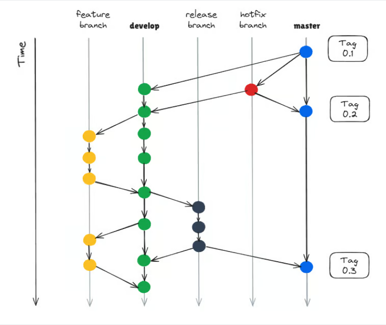

# City Pulse Live - Frontend

A modern and modular frontend application following **clean software engineering principles** and **GitFlow workflow**.  
Focused on scalability, maintainability, and developer experience.

---

## Tech Stack

- **React + TypeScript** – Core framework and type safety  
- **Vite** – Fast build and development environment  
- **React Router** – Declarative client-side routing  
- **Tailwind CSS** – Utility-first styling system  
- **shadcn/ui** – Prebuilt, accessible, and customizable UI components  

---

## Project Overview

This repository implements a component-driven architecture with reusable design patterns, consistent coding standards, and responsive UI/UX.  
It aims to ensure high maintainability, readability, and alignment with best practices in modern web development.

---

## Development Workflow

This project follows the **GitFlow branching model**:

- `main` → Production-ready code  
- `dev` → Integration and testing environment  
- `feature/*`, `release/*`, `hotfix/*` → Managed by specific development tasks  


> [!NOTE] The GitFlow diagram. 
> Image by the author inspired by [Vincent Driessen](https://nvie.com/posts/a-successful-git-branching-model)


---

## Getting Started

```bash
# Install dependencies
npm install

# Start development server
npm run dev

# Build for production
npm run build
```


---

## Credits

**Team (GitHub Profiles):** 
- [Sergio Silva](https://github.com/OneCode182)
- [David Velásquez](https://github.com/DavidVCAI)
- [Geronimo Martínez](https://github.com/MimiRandomS)

© 2025 City Pulse Live, Escuela Colombiana de Ingeniería Julio Garavito.  
ARSW - Software Architectures

All rights reserved.

